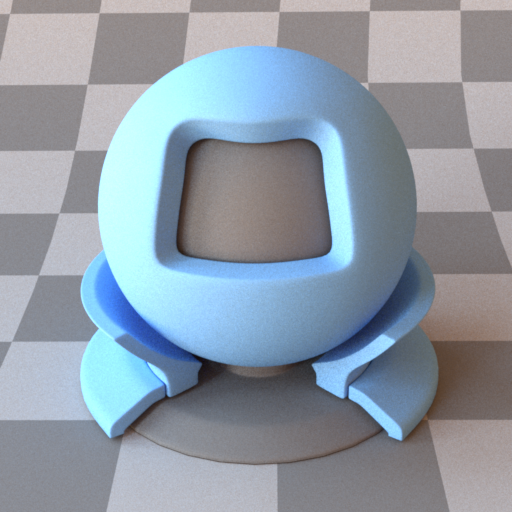
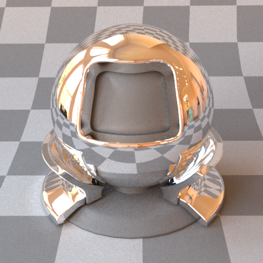
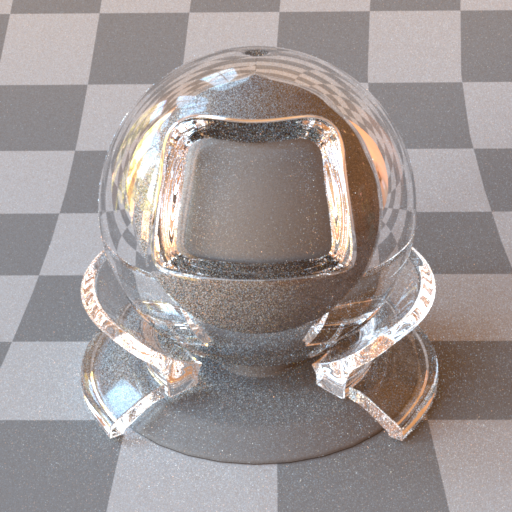
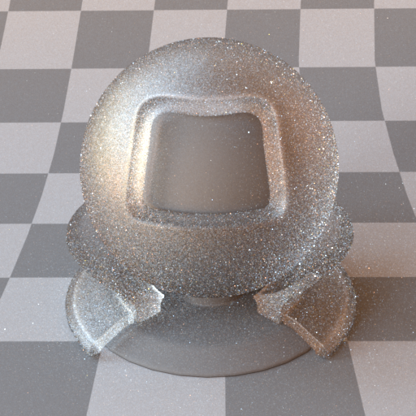
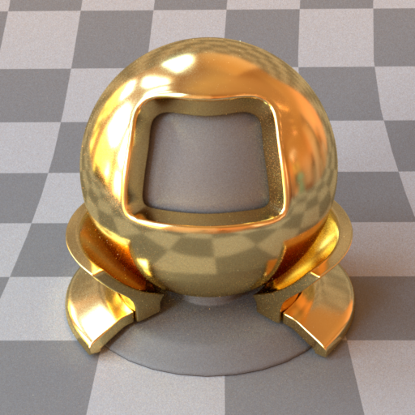
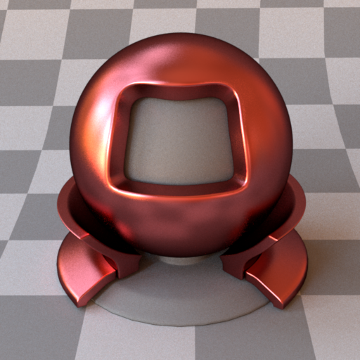
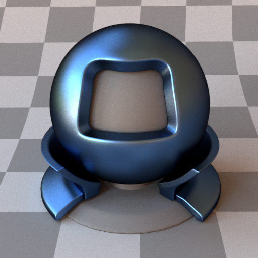
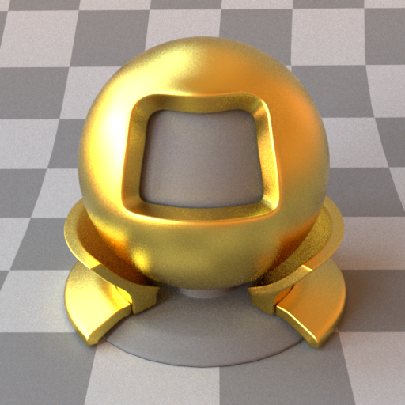
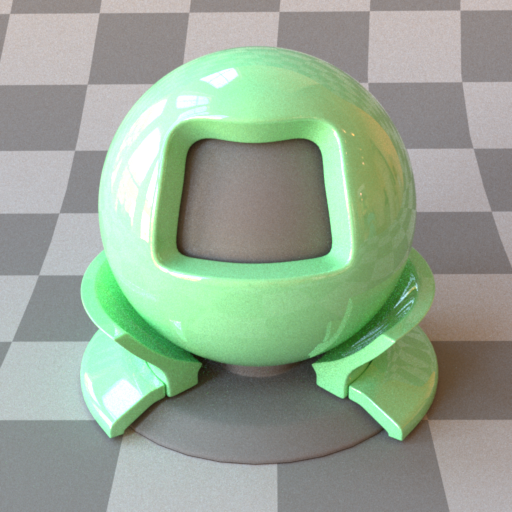

# BSDFs

Materials are attached to shapes either inline or via a named reference. A named BSDF is declared at the top level with an `id` attribute and referenced from shapes using `<ref id="..."/>`.

Each material below shows a preview rendered on the standard material-test ball under an environment map (the `matpreview` scene). Regenerate the swatches with `python3 .verify/render_matpreview_gallery.py`.

---

## Diffuse — `type="diffuse"`

Lambertian (perfectly diffuse) reflectance. Scatters light equally in all directions above the surface. The surface colour can be specified as a constant RGB value or as a bitmap texture. An optional normal map adds tangent-space surface detail without extra geometry.



### Parameters

| Name | Type | Default | Description |
|------|------|---------|-------------|
| `reflectance` | rgb or bitmap | `0, 0, 0` | Diffuse albedo. Values should be in [0, 1]. |
| `normalmap` | bitmap | *(none)* | Tangent-space normal map. RGB image encoded as `[0,1]` → `[-1,1]`. |

### Examples

**Constant colour:**
```xml
<bsdf type="diffuse" id="white_wall">
    <rgb name="reflectance" value="0.8, 0.8, 0.8"/>
</bsdf>
```

**Bitmap texture:**
```xml
<bsdf type="diffuse" id="wood_floor">
    <texture type="bitmap" name="reflectance">
        <string name="filename" value="textures/wood.png"/>
    </texture>
</bsdf>
```

**Texture + normal map:**
```xml
<bsdf type="diffuse" id="stone">
    <texture type="bitmap" name="reflectance">
        <string name="filename" value="textures/stone_albedo.png"/>
    </texture>
    <texture type="bitmap" name="normalmap">
        <string name="filename" value="textures/stone_normal.png"/>
    </texture>
</bsdf>
```

Image textures are expected in sRGB space and are linearised on load. UV coordinates come from the mesh; OBJ files supply them via `vt` entries.

---

## Mirror / Conductor — `type="mirror"` / `type="conductor"`

A perfect specular reflector (the two type names are equivalent). Reflects every incident ray into the mirror direction with no roughness. This is a delta BSDF — it has no diffuse component and contributes nothing to direct illumination samples.



### Parameters

| Name | Type | Default | Description |
|------|------|---------|-------------|
| `reflectance` | rgb | `1, 1, 1` | Spectral tint applied to reflections. Use `1, 1, 1` for a neutral silver mirror. |

### Example

```xml
<bsdf type="mirror" id="silver">
    <rgb name="reflectance" value="0.9, 0.9, 0.9"/>
</bsdf>
```

---

## Dielectric — `type="dielectric"` / `type="glass"`

A smooth dielectric interface (e.g. glass, water, crystal) governed by Fresnel equations. Both reflection and refraction are simulated, including total internal reflection. The surface has no diffuse component.



### Parameters

| Name | Type | Default | Description |
|------|------|---------|-------------|
| `intIOR` or `ior` | float | `1.5` | Index of refraction of the medium inside the surface. The exterior is assumed to be air (IOR = 1.0). |

Common IOR values: glass ≈ 1.5, water ≈ 1.33, diamond ≈ 2.42.

### Example

```xml
<bsdf type="dielectric" id="glass_sphere">
    <float name="intIOR" value="1.5"/>
</bsdf>
```

```xml
<!-- water surface -->
<bsdf type="glass" id="water">
    <float name="ior" value="1.33"/>
</bsdf>
```

---

## Rough dielectric — `type="roughdielectric"` / `type="roughglass"`

A GGX microfacet dielectric: frosted glass that both reflects and refracts through a rough interface. Smaller `alpha` approaches a smooth dielectric.



> **Sampling:** micro-normals are drawn from the full GGX NDF (Walter et al. 2007), not from the *distribution of visible normals* (vNDF, Heitz 2018). vNDF sampling never generates back-facing microfacets and collapses the throughput weight to the masking-shadowing ratio `G₂/G₁`, which would noticeably cut variance here — especially at higher `alpha`.

### Parameters

| Name | Type | Default | Description |
|------|------|---------|-------------|
| `intIOR` or `ior` | float | `1.5` | Interior index of refraction (exterior is air). |
| `alpha` | float | `0.1` | GGX roughness parameter. |
| `specularReflectance` | rgb | `1, 1, 1` | Spectral tint applied to the interface. |

### Example

```xml
<bsdf type="roughdielectric" id="frosted_glass">
    <float name="intIOR" value="1.5"/>
    <float name="alpha" value="0.2"/>
</bsdf>
```

---

## Rough conductor — `type="roughconductor"` / `type="roughplastic"`

A GGX microfacet BSDF modelling a rough reflective surface. The distribution of microfacet normals follows the GGX (Trowbridge-Reitz) model. Increasing `alpha` makes the surface appear more matte.



### Parameters

| Name | Type | Default | Description |
|------|------|---------|-------------|
| `eta` or `reflectance` | rgb | `0.8, 0.8, 0.8` | Spectral reflectance tint. |
| `alpha` | float | `0.3` | GGX roughness parameter. Range (0, 1]: `0.01` is near-mirror, `0.8` is very rough. |

### Example

```xml
<bsdf type="roughconductor" id="brushed_gold">
    <rgb name="eta" value="1.0, 0.77, 0.33"/>
    <float name="alpha" value="0.15"/>
</bsdf>
```

---

## Phong / Blinn — `type="phong"` / `type="blinn"` / `type="blinn_microfacet"`

Classic glossy reflectance models driven by a specular `exponent` (the cosine-power; higher = sharper highlight). `phong` and `blinn` are the energy-normalised lobes; `blinn_microfacet` uses the Blinn distribution in a microfacet formulation.

| `phong` | `blinn` | `blinn_microfacet` |
|:-------:|:-------:|:------------------:|
|  |  |  |

### Parameters

| Name | Type | Default | Description |
|------|------|---------|-------------|
| `reflectance` | rgb or bitmap | `0.8, 0.8, 0.8` | Diffuse/specular base colour. |
| `exponent` | float | `50` | Glossy exponent; larger is shinier. |

### Example

```xml
<bsdf type="blinn" id="glossy_red">
    <rgb name="reflectance" value="0.7, 0.1, 0.1"/>
    <float name="exponent" value="120"/>
</bsdf>
```

---

## Plastic — `type="plastic"`

A smooth coated diffuse surface: a Fresnel-weighted specular coat over a diffuse substrate.



### Parameters

| Name | Type | Default | Description |
|------|------|---------|-------------|
| `reflectance` | rgb or bitmap | `0.5, 0.5, 0.5` | Diffuse substrate colour. |
| `eta`, `intIOR`, or `int_ior` | float | `1.5` | Index of refraction of the dielectric coat. |
| `nonlinear` | boolean | `false` | Enable Mitsuba's coloured internal-scattering model. |

### Example

```xml
<bsdf type="plastic" id="red_plastic">
    <rgb name="reflectance" value="0.8, 0.1, 0.1"/>
    <float name="intIOR" value="1.49"/>
</bsdf>
```

---

## Emitter BSDF — `type="emitter"` / `type="area"`

Marks a surface as a light source when declared as a named BSDF. This is equivalent to the inline `<emitter type="area">` syntax but allows the emissive material to be reused across multiple shapes.

### Parameters

| Name | Type | Default | Description |
|------|------|---------|-------------|
| `radiance` or `emission` | rgb | `1, 1, 1` | Emitted radiance. |

### Example

```xml
<bsdf type="emitter" id="ceiling_light">
    <rgb name="radiance" value="10, 8, 6"/>
</bsdf>

<shape type="rectangle">
    <transform name="toWorld">
        <scale x="0.5" y="0.5" z="0.5"/>
        <translate x="0" y="2.5" z="0"/>
        <rotate angle="90" x="1"/>
    </transform>
    <ref id="ceiling_light"/>
</shape>
```

---

## Two-sided wrapper — `type="twosided"`

A Mitsuba compatibility wrapper. Kestrel's BSDFs are already evaluated on both faces, so a `<bsdf type="twosided">` is transparently unwrapped to its inner BSDF — you can leave the wrapper in imported scenes without effect.

```xml
<bsdf type="twosided" id="wall">
    <bsdf type="diffuse">
        <rgb name="reflectance" value="0.8, 0.8, 0.8"/>
    </bsdf>
</bsdf>
```
