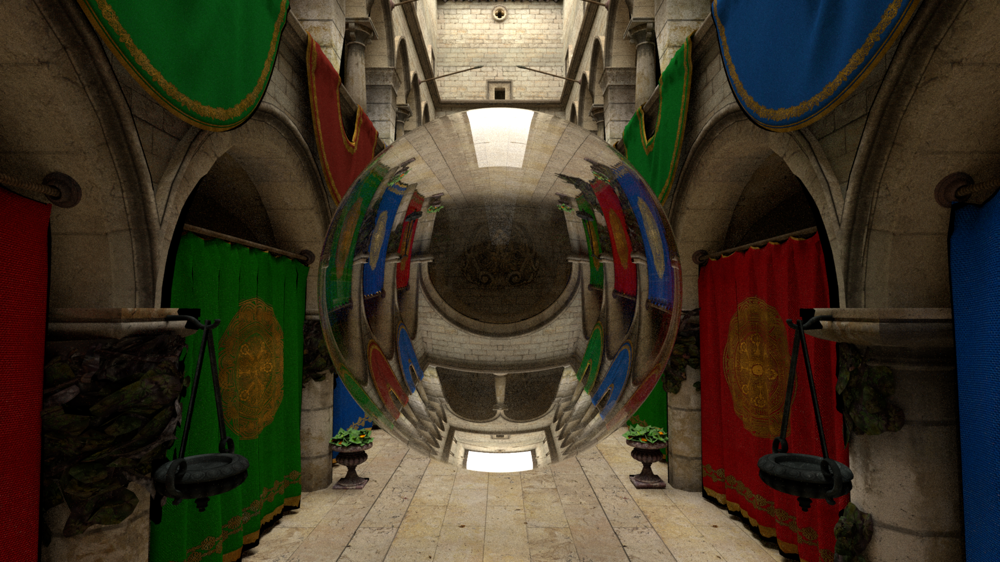

# Kestrel Renderer

Kestrel is a CPU path tracer that reads scenes in a subset of the [Mitsuba 0.6](https://mitsuba-renderer.org) XML format. It produces physically-based images via unidirectional path tracing with Multiple Importance Sampling (MIS) and Next Event Estimation (NEE).



*The Sponza atrium with a dielectric sphere under a large area light, rendered with the path integrator.*

## Building

```bash
cmake -B build -DCMAKE_BUILD_TYPE=Release
cmake --build build -j$(nproc)
```

The binary is placed at `build/kestrel`.

## Running

```
kestrel <scene.xml> [-o <output>] [-i path|direct|direct_bsdf] [-s <spp>] [-t <threads>]
```

| Flag | Default | Description |
|------|---------|-------------|
| `<scene.xml>` | *(required)* | Path to the scene file in Mitsuba XML format. |
| `-o <output>` | `output.exr` | Output file path. The file extension selects the format. |
| `-i <integrator>` | `path` | Rendering algorithm. `path` = full global illumination with MIS; `direct` = single-bounce light sampling (NEE); `direct_bsdf` = single-bounce BSDF sampling. See [Integrators](integrators.md). |
| `-s, --spp <n>` | *(scene)* | Override the scene's `sampleCount`. |
| `-t, --threads <n>` | all cores | Number of worker threads. Defaults to the hardware concurrency. |

### Example

```bash
./build/kestrel data/scenes/cbox/cbox.xml -o render.png
./build/kestrel data/scenes/veach_mi/mi.xml -o render.exr -i direct
```

## Output formats

| Extension | Encoding | Bit depth | Notes |
|-----------|----------|-----------|-------|
| `.png` | sRGB (gamma 2.2) | 8-bit per channel | Suitable for display. |
| `.exr` | Linear float | 32-bit per channel | HDR; use for compositing or tone mapping. |
| `.ppm` | sRGB (gamma 2.2) | 8-bit per channel | ASCII; uncompressed fallback. |

## Rendering settings

Samples per pixel and image resolution are specified inside the scene file (see [`sensors.md`](sensors.md)). The integrator, output path, sample-count override (`-s`), and thread count are the only runtime flags.

---

See the remaining reference pages for scene authoring:

- [Scene format](scene-format.md) — XML structure and transforms
- [Sensors](sensors.md) — camera models
- [Emitters](emitters.md) — lights and environment maps
- [BSDFs](bsdfs.md) — surface materials
- [Shapes](shapes.md) — geometry primitives and mesh loading
- [Integrators](integrators.md) — rendering algorithms
