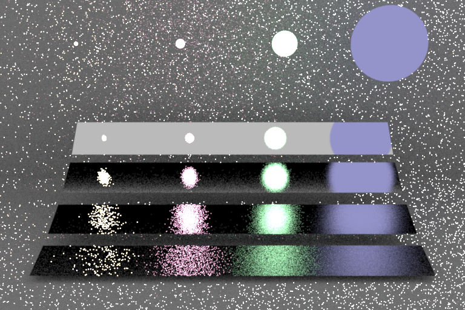
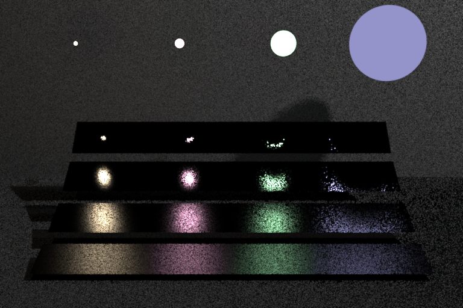
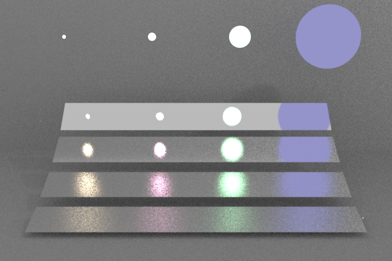

# Integrators

The integrator is selected at the command line with `-i <name>`. It determines how light transport is simulated.

---

## Path tracer — `-i path` *(default)*

A unidirectional path tracer. Each camera ray spawns a path that bounces through the scene until it reaches a light source, escapes, or is terminated by Russian roulette. Direct lighting at each bounce is estimated by Next Event Estimation (NEE), and the NEE and BSDF-sampled contributions are combined using Multiple Importance Sampling (MIS) with the power heuristic (β = 2).

The MIS is **deterministic** (Veach's multi-sample model): every non-specular bounce shoots *both* a light ray (NEE shadow ray) and a BSDF ray (the path continuation), and sums their power-heuristic-weighted contributions — it never randomly selects a single strategy. The light strategy is weighted `w = power(p_light, p_bsdf)`; the BSDF strategy's emission (collected when the continuation lands on an emitter) is weighted `w = power(p_bsdf, p_light)`. Specular/delta lobes (`pdf = 0`) skip the light ray and carry weight 1. The two pdfs are mutually exact for single-emitter scenes; with multiple area lights NEE uses the selected light's pdf while the BSDF strategy uses the full light-mixture pdf — both unbiased.

### Properties

| Property | Value |
|----------|-------|
| Global illumination | Yes — indirect bounces, colour bleeding, caustics (via BSDF sampling) |
| MIS | Power heuristic, β = 2 |
| NEE | One sample per area light, one sample per environment map |
| Russian roulette | Starts at bounce 3; max survival probability 0.95 |
| Hard depth cap | 64 bounces |

### Light transport

- **Point lights** — shadow ray per light; 1/r² falloff; MIS weight = 1 (delta distribution).
- **Area emitters** — one NEE sample from a randomly chosen emitter, combined with BSDF-sampling MIS.
- **Environment map** — one importance-sampled direction, combined with BSDF-sampling MIS.
- **Emissive hit via BSDF sampling** — weighted against the area light PDF to avoid double-counting.

### Usage

```bash
kestrel scene.xml -o output.exr           # path integrator (default)
kestrel scene.xml -o output.exr -i path   # explicit
```

The path integrator is the correct choice for scenes with indirect illumination, area lights, glass, and environment maps. Increase `sampleCount` in the scene file to reduce noise.

---

## Direct illumination — `-i direct` and `-i direct_bsdf`

Single-bounce integrators. Only the first surface hit from the camera is shaded; no recursive scattering occurs. Each comes in a single, deliberately *un-combined* sampling strategy — these are the two estimators that the path integrator's MIS blends, exposed separately so their individual strengths and failure modes are visible (see the comparison below).

- **`-i direct`** — **light sampling (NEE) only.** For each surface point, one NEE sample is drawn from each light source present. Clean on rough/diffuse surfaces; noisy on near-specular ones, where a sampled light point rarely lands inside the narrow BSDF lobe.
- **`-i direct_bsdf`** — **BSDF sampling only.** One ray is scattered according to the BSDF; its contribution is kept if it lands on an emitter. Clean on near-specular surfaces; noisy on rough ones, where a wide BSDF sample rarely hits a small, bright light.

### Properties

| Property | Value |
|----------|-------|
| Global illumination | No — no interreflection or indirect colour bleeding |
| MIS | None (each mode is a single strategy) |
| NEE | `direct`: one sample per area light, one per environment map |
| Russian roulette | None |
| Recursion depth | 1 (camera ray + one shadow or scatter ray) |

### Light transport

- **Point lights** (`direct`) — same as path integrator.
- **Area emitters** — `direct`: one uniform NEE sample; `direct_bsdf`: emission kept when the scattered ray lands on the emitter. No MIS in either.
- **Environment map** — `direct`: one importance-sampled direction; `direct_bsdf`: emission from the escaped ray. No MIS.
- **Specular surfaces** — `direct` returns black on delta BSDFs (a sampled light direction is never the mirror direction); `direct_bsdf` handles them correctly.

### Usage

```bash
kestrel scene.xml -o output.png -i direct        # light sampling
kestrel scene.xml -o output.png -i direct_bsdf   # BSDF sampling
```

The direct integrators are faster per sample and useful for:
- Verifying material and lighting setup before a full path-traced render.
- Scenes lit exclusively by point lights where indirect light is negligible.
- Debugging: if the direct result looks wrong, the issue is in geometry or materials, not path-tracing logic.

They will underestimate brightness in scenes with significant indirect illumination (e.g. Cornell box, interior scenes).

---

## Comparison: the Veach MIS scene

The classic test from Eric Veach's thesis (`data/scenes/veach_mi/mi.xml`) makes the trade-off concrete: four plates of increasing glossiness reflect four area lights of decreasing size. No single estimator is good everywhere.

```bash
kestrel data/scenes/veach_mi/mi.xml -i direct_bsdf -s 32 -o veach_bsdf.exr   # BSDF sampling only
kestrel data/scenes/veach_mi/mi.xml -i direct      -s 32 -o veach_light.exr  # light sampling only
kestrel data/scenes/veach_mi/mi.xml -i path        -s 32 -o veach_path.exr   # full path tracer w/ MIS
```

| BSDF sampling (`direct_bsdf`) | Light sampling (`direct`) | Path tracer + MIS (`path`) |
|:--:|:--:|:--:|
|  |  |  |

All three are rendered at 32 spp.

- **BSDF sampling** is clean on the glossy plates (the scattered ray follows the lobe) but very noisy where the lights are small and bright — those directions are rarely sampled by a broad BSDF lobe.
- **Light sampling** is the mirror image: clean where lights are large, noisy on the near-specular plates, where a point sampled on a light almost never lands inside the tight reflection lobe.
- **The path tracer** combines both per bounce with the power heuristic (β = 2), so each region is denoised by whichever strategy samples it well. It is also a *full* path tracer, so unlike the two single-bounce direct modes it additionally carries indirect illumination — which is why this is MIS path tracing rather than a direct-only MIS estimator.
