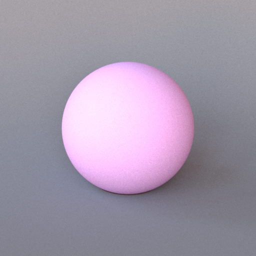
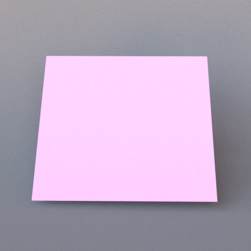
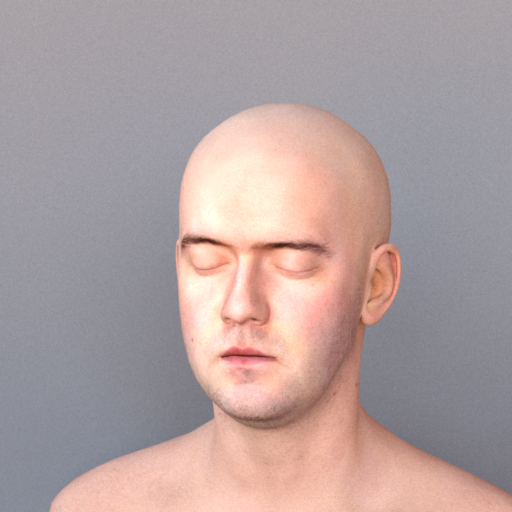
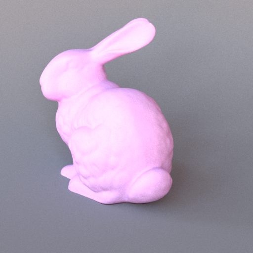
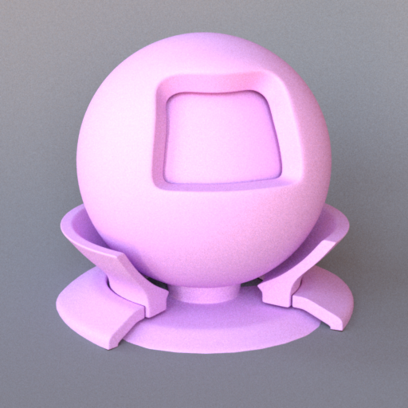
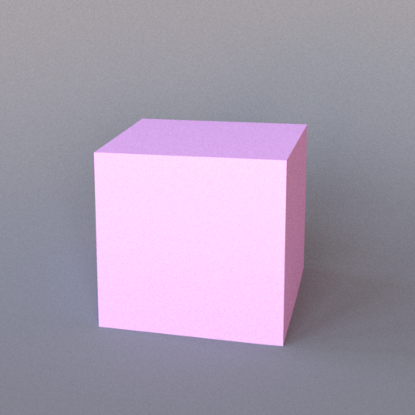

# Shapes

All shapes accept a material, either inline or via `<ref id="..."/>`. Shapes can also host an inline area emitter using `<emitter type="area">`.

---

## Sphere — `type="sphere"`



An analytic sphere. Intersection is computed exactly; no tessellation is involved.

### Parameters

| Name | Type | Default | Description |
|------|------|---------|-------------|
| `center` | point | `0, 0, 0` | World-space centre position. |
| `radius` | float | `1` | Sphere radius in world units. |

### Example

```xml
<shape type="sphere">
    <point name="center" x="0" y="0.5" z="0"/>
    <float name="radius" value="0.5"/>
    <ref id="glass_sphere"/>
</shape>
```

**Emissive sphere:**
```xml
<shape type="sphere">
    <point name="center" x="0" y="2" z="0"/>
    <float name="radius" value="0.2"/>
    <emitter type="area">
        <rgb name="radiance" value="15, 12, 8"/>
    </emitter>
</shape>
```

---

## Rectangle — `type="rectangle"`



A unit square in the XY plane, spanning [−1, 1] × [−1, 1] at Z = 0, with its normal along the Z axis. It therefore stands **upright** by default (think of a wall facing the camera). Use a transform to position, orient, and size it. Rectangles are commonly used for floors, walls, and ceiling lights.

### Example — floor

The default rectangle is vertical, so lay it flat with a 90° rotation about the X axis before placing it:

```xml
<bsdf type="diffuse" id="floor">
    <rgb name="reflectance" value="0.6, 0.5, 0.4"/>
</bsdf>

<shape type="rectangle">
    <transform name="toWorld">
        <scale x="5" y="5" z="1"/>
        <rotate angle="90" x="1" y="0" z="0"/>
        <translate x="0" y="-1" z="0"/>
    </transform>
    <ref id="floor"/>
</shape>
```

**Note:** because the default rectangle is upright, no rotation is needed to use it as a wall — just position it. Rotating 90° around the X axis lays it flat for a floor or ceiling (as above):
```xml
<rotate angle="90" x="1" y="0" z="0"/>
```

---

## OBJ mesh — `type="obj"`



Loads a Wavefront OBJ file. Triangle faces are extracted and added to the scene individually. UV coordinates (`vt` entries) are parsed and forwarded to the material for texture sampling and normal mapping.

### Parameters

| Name | Type | Default | Description |
|------|------|---------|-------------|
| `filename` | string | *(required)* | Path to the `.obj` file, relative to the scene file. |

### Transforms

| Element | Attributes | Description |
|---------|------------|-------------|
| `<scale>` | `x`, `y`, `z` | Non-uniform scale. |
| `<translate>` | `x`, `y`, `z` | World-space offset. |
| `<rotate>` | `x`, `y`, `z`, `angle` | Axis-angle, degrees. |

Operations are applied in the order they appear.

### Example

```xml
<bsdf type="diffuse" id="teapot_mat">
    <texture type="bitmap" name="reflectance">
        <string name="filename" value="teapot_albedo.png"/>
    </texture>
</bsdf>

<shape type="obj">
    <string name="filename" value="teapot.obj"/>
    <transform name="toWorld">
        <scale x="0.5" y="0.5" z="0.5"/>
        <translate x="0" y="-1" z="0"/>
    </transform>
    <ref id="teapot_mat"/>
</shape>
```

---

## PLY mesh — `type="ply"`



Loads a Stanford PLY file (binary or ASCII). Triangles are extracted in the same way as OBJ.

### Parameters

| Name | Type | Default | Description |
|------|------|---------|-------------|
| `filename` | string | *(required)* | Path to the `.ply` file, relative to the scene file. |

Supports the same `<scale>`, `<translate>`, and `<rotate>` transforms as OBJ.

### Example

```xml
<bsdf type="diffuse" id="bunny_mat">
    <rgb name="reflectance" value="0.7, 0.7, 0.8"/>
</bsdf>

<shape type="ply">
    <string name="filename" value="bunny.ply"/>
    <transform name="toWorld">
        <scale x="10" y="10" z="10"/>
        <translate x="0" y="-1" z="0"/>
    </transform>
    <ref id="bunny_mat"/>
</shape>
```

---

## Serialized mesh — `type="serialized"`



Loads a mesh from Mitsuba's binary `.serialized` format (zlib-compressed). A single
`.serialized` file may pack many meshes; `shapeIndex` selects which one. This is the
format used by the larger bundled scenes (e.g. Sponza, the material preview).

### Parameters

| Name | Type | Default | Description |
|------|------|---------|-------------|
| `filename` | string | *(required)* | Path to the `.serialized` file, relative to the scene file. |
| `shapeIndex` | integer | `0` | Index of the sub-mesh to load from the file. |

A `<transform name="toWorld">` block (matrix form) positions the mesh.

### Example

```xml
<shape type="serialized">
    <string name="filename" value="sponza.serialized"/>
    <integer name="shapeIndex" value="3"/>
    <ref id="stone_wall"/>
</shape>
```

---

## Cube — `type="cube"`



An axis-aligned cube spanning [−1, 1] on each axis, emitted as 12 triangles with
flat (per-face) geometric normals. Position, orient, and size it with a transform.

### Example

```xml
<shape type="cube">
    <transform name="toWorld">
        <scale x="0.5" y="0.5" z="0.5"/>
        <translate x="0" y="0.5" z="0"/>
    </transform>
    <ref id="box_mat"/>
</shape>
```

---

## Transforms

All mesh shapes (OBJ, PLY, serialized), the cube, and the rectangle accept a `<transform name="toWorld">` block. Transforms are applied in scene-file order: typically **scale first, then translate, then rotate**.

```xml
<transform name="toWorld">
    <scale x="2" y="1" z="2"/>
    <translate x="0" y="0" z="-1"/>
    <rotate angle="45" x="0" y="1" z="0"/>
</transform>
```

The `<rotate>` element takes an axis specified by `x`, `y`, `z` components (need not be normalised) and an angle in degrees.
